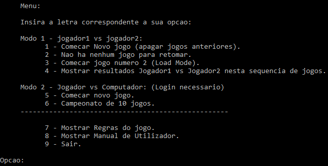
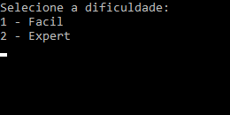
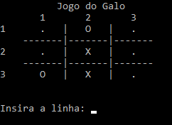

# [Smart Noughts & Crosses Game](https://github.com/marceloqueiros/smart-noughts-and-crosses-game)

by [Marcelo Queirós](https://www.linkedin.com/in/marceloqueiros/)

[Smart Noughts & Crosses Game](https://github.com/marceloqueiros/smart-noughts-and-crosses-game/tree/master/VSproject) has been implemented with several options like: 
* Play with 2 human players;
* Play against the computer in easy or expert mode;
* Championship of 10 games and subsequent statistics;
* Players are authenticated, statistics are saved and the status of unfinished games is saved so that they can be resumed.

This game was implemented exclusively in C++.

The easy level just implements a mode where the computer plays randomly, while in expert mode several techniques are implemented for the computer to defend itself in the best way and to attack in the best way analyzing the position of the opponent. The implementation used was analysis case-by-case. It turns out that the computer wins most of the time against normal players and can only lose when it is the human player to start the game and he can use special techniques used to do not give chances to the opponent.

|  |
|:--:| 
| **Fig.1:** Game menu (in portuguese language).  |

|  |
|:--:| 
| **Fig.2:** Choose difficulty of the game after choosing option. |

|  |
|:--:| 
| **Fig.3:** Playing the game (the current player must select the column and line numbers).  |
